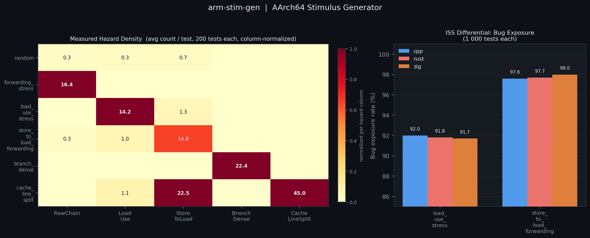

# arm-stim-gen

[](https://github.com/CldStlkr/arm-stim-gen/actions/workflows/ci.yml)
[](generator/)
[](rust-generator/)
[](zig-generator/)
[](https://developer.arm.com/architectures/cpu-architecture/a-profile)
[](https://www.qemu.org/)



AArch64 assembly stimulus generator for CPU microarchitecture verification. Three independent backends (C++23, Rust, and Zig) emit randomized assembly programs that target specific pipeline hazards. The orchestrator assembles and links each program, runs it under `qemu-aarch64`, captures a register-file signature, and verifies it against a stored golden. An intentionally-buggy Python ISS can be run in differential mode to measure how well a given strategy exposes a specific microarchitecture bug.

---

## Architecture

```mermaid
flowchart LR
    IN([seed + strategy + count]) --> GEN{generator}

    GEN -->|--generator cpp|  CPP["stim_gen\nC++23 / cmake"]
    GEN -->|--generator rust| RUST["rust-generator\nRust 2024 / cargo"]
    GEN -->|--generator zig|  ZIG["zig-generator\nZig 0.16 / build.zig"]

    CPP  --> ASM[test.S]
    RUST --> ASM
    ZIG  --> ASM

    ASM --> AS["aarch64-linux-gnu-as"]
    AS  --> OBJ[test.o]
    OBJ --> LD["aarch64-linux-gnu-ld\n-Ttext=0x400000"]
    LD  --> ELF[test.elf]
    ELF --> QEMU["qemu-aarch64"]
    QEMU --> SIG["signature.bin\n10 x uint64_le"]

    SIG --> CHK{golden exists?}
    CHK -->|no|  REC([record golden])
    CHK -->|yes| DIFF{byte diff}
    DIFF -->|match|    PASS([PASS])
    DIFF -->|mismatch| FAIL([FAIL])

    SIG -.->|optional --bug| ISS["iss.py\nbuggy Python ISS"]
    ISS -.-> ISSDIFF{diff vs golden}
    ISSDIFF -.->|diverges| EXP([bug exposed])
    ISSDIFF -.->|matches|  NEXP([not triggered])
```

Each generator produces identical output for the same seed and strategy. Goldens are stored per-generator under `tests/golden/<generator>/`.

---

## Coverage Points

Each emitter records exactly one coverage point when it fires. The five points target distinct pipeline hazards, with one exception noted for `CacheLineSplit`.

| Point | Emitted sequence | Hazard |
|---|---|---|
| `RawChain` | `{ALU} xdst, x<last_written>, xsrc2` | ALU-to-ALU forwarding: `src1` is biased toward the register written by the immediately preceding instruction, creating a back-to-back RAW dependency on the ALU result path |
| `LoadUseHazard` | `LDR xdst, [x22, #off]` / `{ALU} xalu, xdst, xsrc2` | Load-use hazard: the loaded value is consumed by the immediately following instruction; requires a pipeline stall or out-of-order hiding even with result forwarding, because the load data is not available until after the memory stage |
| `StoreToLoadFwd` | `STR xsrc, [x22, #off]` / `LDR xdst, [x22, #off]` | Store-to-load forwarding: the LDR immediately follows a STR to the same address; the store data must be forwarded from the store buffer rather than read from the cache |
| `BranchDense` | `CBZ/CBNZ xreg, .Lskip_N` / `NOP` / `.Lskip_N:` | Conditional branch: skips exactly one instruction; exercises branch prediction and the fetch redirect path |
| `CacheLineSplit` | `STR xsrc, [x22, #60]` / `LDR xdst, [x22, #60]` | Cache line split: `scratch_buf` is `.align 6`, so offset 60 places an 8-byte access at bytes `[60, 68)`, straddling the 64-byte boundary. Because the address is fixed and the STR immediately precedes the LDR at the same offset, this sequence **also exercises store-to-load forwarding** at the split address. Only `CacheLineSplit` is recorded; the secondary `StoreToLoadFwd` behavior is untracked |

---

## Strategies

| Strategy | Tracked coverage target | Emitter pool | Notes |
|---|---|---|---|
| `random` | *(none)* | `MovImm`, `AluRegReg`, `LdrReg`, `StrReg` | No emitter in this pool calls `hit_coverage()`; all coverage point counts will be 0 |
| `forwarding_stress` | `RawChain` | `ForwardingAlu x3`, `MovImm` | |
| `load_use_stress` | `LoadUseHazard` | `LoadUse x2`, `StrReg`, `MovImm` | `StrReg` seeds the scratch buffer so `LoadUse` has valid load offsets |
| `store_to_load_forwarding` | `StoreToLoadFwd` | `StoreToLoad x2`, `MovImm`, `AluRegReg` | |
| `branch_dense` | `BranchDense` | `BranchSkip x3`, `MovImm` | |
| `cache_line_split` | `CacheLineSplit` | `CacheLineSplit x3`, `MovImm` | Also exercises `StoreToLoadFwd` (see above); only `CacheLineSplit` is recorded |

---

## Build

Dependencies: `cmake`, `cargo`, `zig`, `aarch64-linux-gnu-as`, `aarch64-linux-gnu-ld`, `qemu-aarch64`

### C++ (cmake, C++23)

```sh
cmake -B generator/build generator
cmake --build generator/build --parallel
```

Binary: `generator/build/stim_gen`

### Rust (cargo, edition 2024)

```sh
cargo build --release --manifest-path rust-generator/Cargo.toml
```

Binary: `rust-generator/target/release/rust-generator`

### Zig (0.16)

```sh
cd zig-generator && zig build -Doptimize=ReleaseFast
```

Binary: `zig-generator/zig-out/bin/stim_gen`

---

## Usage

### Single test

```sh
python3 scripts/run.py \
  --generator cpp \
  --seed 0xdeadbeefcafe0000 \
  --count 30 \
  --strategy load_use_stress
```

### Batch mode (aggregate coverage)

```sh
python3 scripts/run.py \
  --generator rust \
  --batch 1000 \
  --strategy store_to_load_forwarding
```

### ISS differential (bug hunting)

```sh
python3 scripts/run.py \
  --generator zig \
  --seed 0x1234 \
  --bug load_use \
  --bug store_to_load
```

Full argument reference:

| Flag | Default | Description |
|---|---|---|
| `--generator` | `cpp` | Backend: `cpp`, `rust`, `zig` |
| `--seed` | random | RNG seed (0x hex or decimal, 0 = random) |
| `--count` | 20 | Instructions to generate |
| `--strategy` | `random` | Emitter strategy (see table above) |
| `--batch N` | 1 | Run N tests, print aggregate coverage |
| `--bug` | (none) | Enable ISS bug: `load_use`, `store_to_load` (repeatable) |
| `--analyze` | off | Run post-hoc static hazard analysis on each generated `.S`; reports measured hazard counts alongside emitter-reported coverage |

---

## ISS

`scripts/iss.py` is an intentionally-buggy AArch64 ISS that executes the instruction subset produced by the generators. It writes a register-file signature in the same binary format as the QEMU-run test programs. Two bugs are switchable at runtime:

| Bug flag | Behavior |
|---|---|
| `load_use` | ALU after LDR reads the pre-load register value instead of the loaded value |
| `store_to_load` | LDR after STR to the same address returns the pre-store value |

The orchestrator runs the ISS, diffs its output against the QEMU golden, and reports whether the bug was triggered. A 1000-test batch with `load_use_stress` exposes the `load_use` bug in ~92% of tests; `store_to_load_forwarding` exposes `store_to_load` in ~98%.

---

## Repository Layout

```
arm-stim-gen/
  generator/            C++23 generator (cmake)
    src/
      emitters/         one .cpp/.hpp per instruction pattern
      state.{cpp,hpp}   generator register/memory state machine
      prologue.{cpp,hpp} AArch64 harness: prologue + epilogue emission
  rust-generator/       Rust port (cargo)
    src/
      emitters/
  zig-generator/        Zig port (build.zig)
    src/
      emitters/
  scripts/
    run.py              orchestrator: generate -> assemble -> link -> QEMU -> golden
    iss.py              buggy Python ISS for differential testing
    analyze.py          post-hoc static hazard analyzer (parses .S, counts actual hazard patterns)
    gen_chart.py        measures hazard rates across all strategies and regenerates assets/overview.png
  tests/
    golden/             stored QEMU register signatures (per generator, per seed)
```
